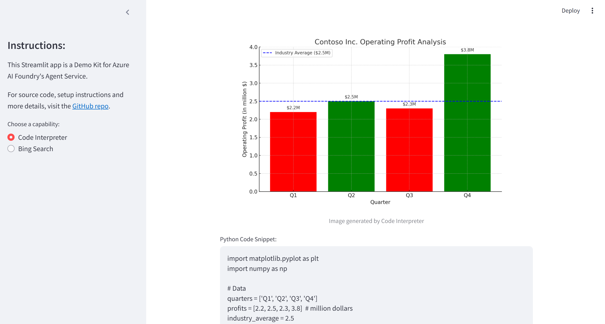

# Azure AI Foundry: Agent Service - UI Demo Kit

[Agent Service](https://learn.microsoft.com/en-us/azure/ai-services/agents/overview) is a powerful offering within Azure AI Foundry that allows you to develop intelligent AI agents. AI agents can be customised to answer questions, perform autonomous sets of tasks and interact with users naturally and intuitively.

This repo contains the source code for a Streamlit-based UI Demo Kit showcasing various capabilities of the Agent Service, including:
- Solving complex problems with the `Code Interpreter` (which builds and runs sandboxed Python code);
- Grounding model outputs (completions) with real-time `Bing Search` results;
- with more to come...

> [!NOTE]
> The Streamlit app can be run locally on your computer and requires access to AI models deployed in Azure AI Foundry. Alternatively, you can deploy a pre-built app using the provided Docker image.

## Table of contents:
- [Part 1: Configuring solution environment](https://github.com/LazaUK/AIFoundry-AgentService-Streamlit#part-1-configuring-solution-environment)
- [Part 2: Web app - User Guide](https://github.com/LazaUK/AIFoundry-AgentService-Streamlit#part-2-web-app---user-guide)
- [Part 3: Web app - Docker image option](https://github.com/LazaUK/AIFoundry-AgentService-Streamlit#part-3-web-app---docker-image-option)
- [Part 4: Demo videos on YouTube](https://github.com/LazaUK/AIFoundry-AgentService-Streamlit#part-4-demo-videos-on-youtube)

## Part 1: Configuring solution environment
1. Copy the connection string from your AI Foundry Project settings, as shown in the image below:

2. Set the environment variable for the copied Project connection string:
    - _Windows_: Add **AZURE_FOUNDRY_PROJECT_CONNSTRING** as a system variable with the copied string as its value;
    - _macOS/Linux_: Set the variable in your terminal:
      ``` bash
      export AZURE_FOUNDRY_PROJECT_CONNSTRING="your_connection_string"
      ```
3. Add other environment variables to enable specific UI Demo Kit capabilities:

| Environment Variable | Description | Scenario |
| --- | --- | --- |
| ```AZURE_FOUNDRY_GPT_MODEL``` | Deployment name of the **_Azure OpenAI_** GPT model | * |
| ```AZURE_FOUNDRY_BING_SEARCH``` | Connection name of the **_Bing Search_** resource | Grounding with Bing Search |

4. Install the required Python packages using the **pip** command and the provided requirements.txt file:
``` PowerShell
pip install -r requirements.txt
```

> [!NOTE]
> Local installation utilises the _DefaultAzureCredential_ class. Depending on your environment, the UI Demo Kit will search for available Azure identities in the order described [here](https://learn.microsoft.com/en-us/python/api/azure-identity/azure.identity.defaultazurecredential?view=azure-python).

## Part 2: Web app - User Guide
1. To launch the web app, run the following command from the root folder of this repo:
``` PowerShell
streamlit run AgentService_Streamlit_v1.py
```
2. If everything was installed correctly as per Part 1's instructions, you should be able to access the demo solution's web page locally at http://localhost:8501.

3. The UX is intentionally minimalistic. Here's how to use it:
    * **_Choose a Capability_**: Begin by choosing the desired capability from the left-side navigation panel.
    * **_Enter Your Prompt_**: Each scenario comes with a default prompt. You can modify it in the provided text area.
    * **_Run the Agent_**: Click the "Run" button. The underlying Agent Service will utilise relevant tools, with the run status reflected in the progress bar.
    * **_View the Output_**: Depending on the selected scenario, the UI Demo Kit may produce its output in text, code and image formats.

> [!NOTE]
> As a Generative AI solution, the Agent Service is inherently non-deterministic. Therefore, it’s normal to receive slightly different outputs in the UI Demo Kit for the same prompts.

## Part 3: Web app - Docker image option
This repo includes a companion Docker image on GitHub Container Registry (GHCR), containing a pre-built web app with all dependencies. It allows you to launch the UI Demo Kit as a container without getting deep into its code's specifics.

There are two ways to utilise the provided Docker image:

### a) Deploying as an Azure Web App:
1. Create a new Azure Web App and set the source container to:
    * `_Image Source_`: Other container registries
    * `_Access type_`: Public
    * `_Registry server URL_`: https://ghcr.io
    * `_Image and tag_`: lazauk/uidemokit-agentservice:latest
    * `_Port_`: 8501
[Web App - Container Config](images/webapp_containerconfig.png)
2. Enable **Managed Identity** for your newly created Web App:
[Web App - Managed Identity](images/webapp_identity.png)
3. In Azure AI Foundry, assign your Web App's managed identity the **Azure AI Developer** role:
[Web App - Managed Identity](images/webapp_identityRBAC.png)
4. Add new **application settings** for each environment variable described in Part 1 above.
[Web App - Managed Identity](images/webapp_envvars.png)

### b) Using the Docker image as a base for your custom one:
1. If you prefer to customise the web app, you can use the provided Docker image as a base for your own Dockerfile. Begin your Dockerfile with the following line:
``` PowerShell
FROM ghcr.io/lazauk/uidemokit-agentservice:latest
```
2. The main script (**AgentService_Streamlit_v1.py**) is located in the /app working directory of the container.

> [!WARNING]
> If deploying the Docker container locally or on another cloud platform, you will need to configure a mechanism to pass credentials for a service principal authorised to access your Azure AI Foundry resources. This is not required when deploying to Azure Web App with Managed Identity.

## Part 4: Demo videos on YouTube
This is a [playlist of short videos](https://www.youtube.com/playlist?list=PLcAssiH4f14tXdGMbGwOoUbg7el5QPMC9) demonstrating this solution in action.
