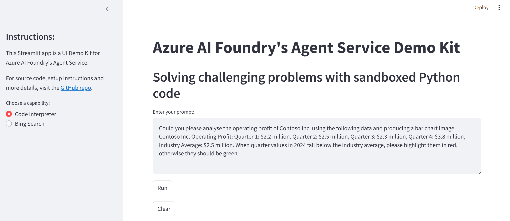

# Azure AI Foundry: Agent Service - UI Demo Kit

[Agent Service](https://learn.microsoft.com/en-us/azure/ai-services/agents/overview) is a powerful offering within Azure AI Foundry that allows you to build and deploy intelligent AI agents. Such AI agents can be customised to answer questions, perform autonomous set of tasks and interact with users in a natural and intuitive way.

In this repo, you will find the source code of a Streamlit-based UI Demo Kit that showcases Agent Service's various capabilities, such as:
- Solving challenging problems with `Code Interpreter` (that builds and runs sandboxed Python code);
- Grounding model's output (completion) with real-time `Bing Search` results;
- with more to come...

> [!NOTE]
> The Streamlit app can run locally on your computer and requires access to AI model(s) deployed in Azure AI Foundry. Alternatively, you can deploy ready-to-use pre-built app from the provided Docker image.

## Table of contents:
- [Part 1: Configuring solution environment](https://github.com/LazaUK/AIFoundry-AgentService-Streamlit#part-1-configuring-solution-environment)
- [Part 2: Web app - User Guide](https://github.com/LazaUK/AIFoundry-AgentService-Streamlit#part-2-web-app---user-guide)
- [Part 3: Web app - Docker image option](https://github.com/LazaUK/AIFoundry-AgentService-Streamlit#part-3-web-app---docker-image-option)
- [Part 4: Demo videos on YouTube]()

## Part 1: Configuring solution environment
1. Copy the connection string from your AI Foundry's Project settings as shown in the image below:

2. Set environment variable for the copied Project's connection string:
    - _Windows_: Add **AZURE_FOUNDRY_PROJECT_CONNSTRING** as a system variable with the copied string as its value.
    - _macOS/Linux_: Set the variable in your terminal:
      ``` bash
      export AZURE_FOUNDRY_PROJECT_CONNSTRING="your_connection_string"
      ```
3. Add other environment variables to enable specific UI Demo Kit capabilities:

| Environment Variable | Description | Scenario |
| --- | --- | --- |
| ```AZURE_FOUNDRY_GPT_MODEL``` | Deployment name of **_Azure OpenAI_** GPT model | * |
| ```AZURE_FOUNDRY_BING_SEARCH``` | Connection name of **_Bing Search_** resource | Grounding with Bing Search |
4. Install the required Python packages, by using the **pip** command and the provided requirements.txt file.
``` PowerShell
pip install -r requirements.txt
```

## Part 2: Web app - User Guide
1. To launch the Web app, run the following command from this repo's root folder:
```
streamlit run AgentService_Streamlit_v1.py
```
2. If everything was installed correctly as per the Part 1's instructions above, you should be able to access the demo solution's Web page locally at http://localhost:8501.

3. The UX is intentionally minimalistic. Begin by choosing required capability from the left-side navigation panel.
4. Next, enter your prompt (each scenario comes with its default prompt) and click the "_Run_" button. Underlying Agent Service will utilise relevant tool(s), with the run status reflected in the progress bar. Depending on the selected scenario, the output may contain text, code and image data.

> [!NOTE]
> As a Generative AI solution, the Agent Service is inherently non-deterministic. Therefore, it’s normal to receive slightly different outputs in UI Demo Kit for the same prompts.

## Part 3: Web app - Docker image option
This repo comes with a companion Docker image on GitHub Container Registry (GHCR), which has a pre-built Web app with all the required dependencies. It allows you to launch the demo solution as a container without getting deep into its code's specifics.

There are 2 potential options to re-use the provided Docker image.

### a) Using the Docker image "as is":
1. First you can download the image from GHCR and verify that it's accessible.
```
docker pull ghcr.io/lazauk/gpt4v-outofstock:latest
```
2. Then you can launch it on your local machine and pass the values of 4 expected environment variables, described in Part 1 above. If you have values of those variables already setup on your host machine, their values will be automatically passed with the Docker run command below.
```
docker run -p 8501:8501 --env OPENAI_API_BASE --env OPENAI_API_DEPLOY_VISION --env OPENAI_API_KEY --env OPENAI_API_VERSION ghcr.io/lazauk/gpt4v-outofstock:latest
```

### b) Using the Docker image as a base for your custom one:
1. You can refer to the companion Docker image in your Dockerfile.
```
FROM ghcr.io/lazauk/gpt4v-outofstock:latest
```
2. The **GPT4V_Streamlit.py** file is located in **/app** working directory, while the images are in **/app/images**, where you can update / replace them to customise the solution.

## Part 4: Demo videos on YouTube
This is a [playlist of short videos](https://www.youtube.com/playlist?list=PLcAssiH4f14tXdGMbGwOoUbg7el5QPMC9) to demo this solutioon in action.
